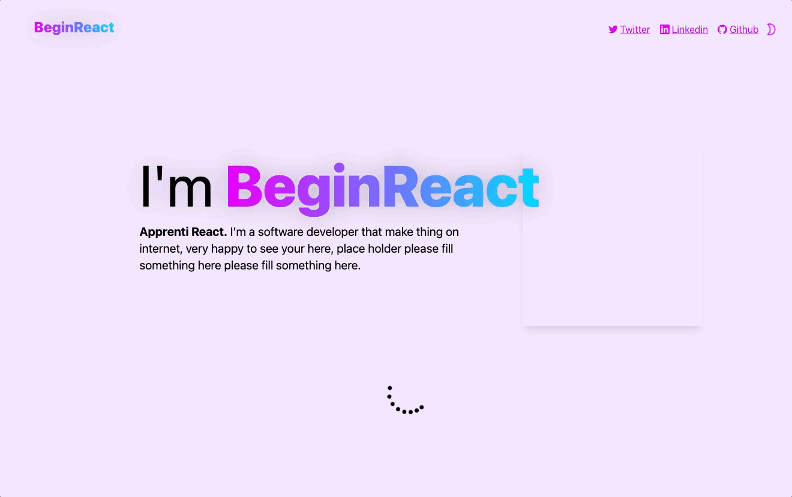
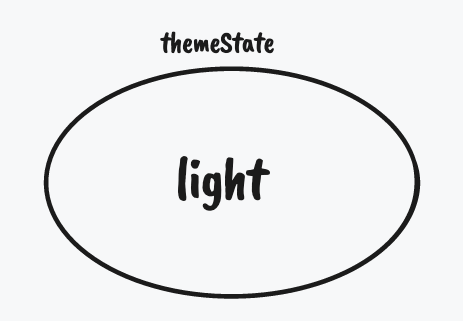
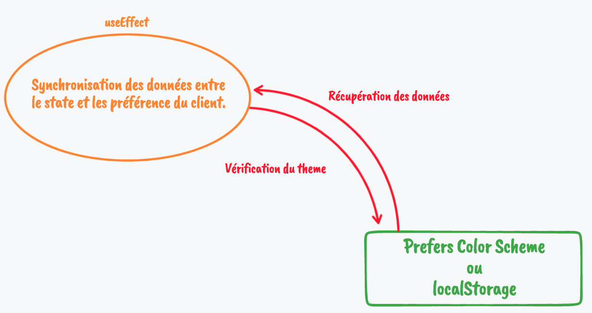
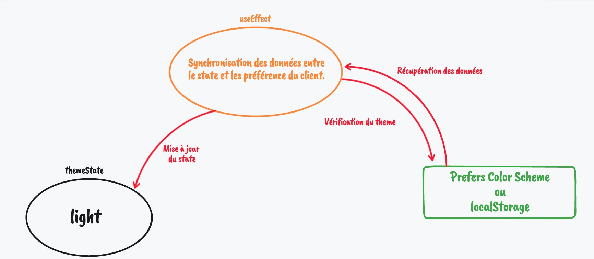

## Comment obtenir le Dark mode PARFAIT

### Quel peut être le souci du Dark Mode ?

Le dark mode peu s'avérer compliqué à implémenter dans une application, dans une des leçons de BeginReact, nous avions pour mission de mettre en place un Dark Mode.

Une fois mis en place c'est là que nous observons le **PROBLÈME**;
Si l'utilisateur à choisis le thème sombre dans ses préférences ou dans l'application, durant le chargement initial de l'application nous obtiendrons cet effet de scintillement.



Notre effet de scintillement est due au fait que notre application applique par défaut le thème clair, et étant donné que c'est React qui gère le rendu de notre application web.

Lors du premier render de notre app, tous les states vont être égal à leur valeur par défaut. (Dans notre cas, le thème sera égal à *light*).



Ensuite notre application se synchronise avec les préférences utilisateur ou le localStorage.



Et ensuite nous mettons à jour notre state :
 Donc si notre thème était light mais que l'utilisateur préfère les thèmes dark, alors nous mettons à jour l'état de notre application pour qu'elle applique le thème sombre.



Et c'est à **cette mise à jour** de notre état, que l'application va scintiller.

### Résolution

Dans notre cas, nous sommes dans une application NextJS, est le rendu se fais côté serveur en premier temps.

Nous devons libérer le serveur de la gestion des variables CSS, ce n'est plus à notre serveur de gérer cette partie, si on laisse le serveur gérer les variables et que nous essayons de les gérer sur le client avant réceptions des données serveur nous obtiendrons une erreur dans notre console.


**Voici un exemple d'erreur que l'on pourrait obtenir**

### Du ménage

Commencer par *commenter* ou *supprimer* vos variables CSS dans votre fichier `themes.css` (Garder vos valeurs vous en aurez besoin pour la suite)

### Préparation du Script

#### Commençons par  `app.js`

Pour commencer il va falloir récupérer les choix de l'utilisateur avant que React soit chargé dans la page.

Nous allons utiliser la balise `Script` que next nous fournis ([Scripts NextJS](https://nextjs.org/docs/basic-features/script) )  et on la configure avec une stratégie en `beforeInteractive`, cela permet au script de se lancer avant toute intervention de React, il est donc Prioritaire !
Maintenant on lui indique la source de notre script (que nous avons mis dans notre dossier `public/`)

Donc notre balise `Script` ressemble à ça :
```JSX
// app.js
<Script strategy={"beforeInteractive"} src={'/myScript.js'} />
```

Ensuite nous créons notre fichier Javascript qui contiendra notre script qui va initialiser les variables CSS afin quel correspondent au thème de notre utilisateur.

#### Notre script JS  `myScript.js`

J'ai commencé mon script par mes variables CSS:
```JS
const CSS_THEME_VARIABLES = {  
  light: {  
    primary: "234 0 255",  
    secondary: "4 217 255",  
  
    background: "242 230 254",  
    paper: "255 195 248",  
    "text-primary": "0 0 0",  
    "text-secondary": "38 38 38",  
  },  
  dark: {  
    primary: "0 173 181",  
    secondary: "238 238 238",  
  
    background: "34 40 49",  
    paper: "57 62 70",  
    "text-primary": "255 255 255",  
    "text-secondary": "238 238 238",  
  },  
};
```

Ceci étant faits je pense que l'on peut créer nos variables CSS dans un fichier *JSON* afin de rendre la modification plus simple et plus maintenable par la suite.
Mais personnellement j'ai une erreur ESLint, j'ai donc finit par laisser mes variables CSS dans mon fichier JS.
![[ESLint_error.png]]

Afin de pouvoir synchroniser mon **App** avec le **Client**, ainsi que pour simplifier la modification du thème, c'est donc ce Script qui gère le thème pour toute l'application, et je vais donc stocker mon thème dans le localStorage (on pourrait très bien choisir le sessionStorage dans ce cas, les deux fonctionnent).
Je crée donc deux fonctions (getter / setter) pour mon localStorage:
```JS
const LOCAL_THEME_VARIABLES_KEY = "themeVariables";  
  
// Return CSS variables object, see above.  
const getLocalThemeVariables = () =>  
  localStorage.getItem(LOCAL_THEME_VARIABLES_KEY) &&  
  JSON.parse(localStorage.getItem(LOCAL_THEME_VARIABLES_KEY));  
  
// Set the CSS_THEME_VARIABLES in the localStorage for the app  
const setLocalThemeVariables = () =>  
  localStorage.setItem(  
    LOCAL_THEME_VARIABLES_KEY,  
    JSON.stringify(CSS_THEME_VARIABLES)  
  );
```

Maintenant il va nous falloir initialiser nos variables CSS à l'arrivée de notre client sur le site, pour ça je créer une nouvelle fonction (Oui encore, j'adore les fonctions 💙 ).

Dans ma fonction je vais initialiser mes variables dans le `body` pour soucis de bonne pratique.

```JS
const setInitDefaultThemeColor = () => {  
  if (!getLocalThemeVariables()) setLocalThemeVariables();  
  const getThemeVariables = getLocalThemeVariables();  
  
  const getStoredColorScheme = localStorage.getItem("theme");  
  const userColorScheme = window.matchMedia("(prefers-color-scheme: light)")  
    .matches  
    ? "light"  
    : "dark";  
  
  const theme = getStoredColorScheme ?? userColorScheme;  
  
  for (const variableName in getThemeVariables[theme]) {  
    // Set CSS variables to the HTML tag element.  
    document.body.style.setProperty(  
      `--color-${variableName}`,  
      getThemeVariables[theme][variableName]  
    );  
  }  
};
```

Et maintenant si on exécute la fonction comme t'elle on va se retrouver avec une erreur, car il va nous dire que `document.body is undefined`.
Donc pour pallier à ce problème nous allons ajouter un événement sur le DOM afin d'attendre le chargement de celui-ci.

```JS
document.addEventListener("DOMContentLoaded", setInitDefaultThemeColor);
```

Est **BAM, IT'S WORK**, enfin presque, l'effet de scintillement à disparu (normalement 👀 ), mais par contre on a un souci avec notre app sur le changement de thème via le toggle 😬 .

#### Modification de useTheme

Normalement vous devez avoir un hook personnalisé, qui vous permez de gérer l'état d'affichage de votre application.

Personnellement le mien ressemblez  à ça :
```JS
// useTheme.js
import { useEffect, useState } from "react";  
import { useUserColorScheme } from "./useUserColorScheme";  
  
// Key for localStorage  
const THEME_LOCAL_KEY = "theme";  
  
export const useTheme = () => {  
  // Use "preferred" to default value, to know if user set a value for color scheme.  
  const [theme, setTheme] = useState("preferred");  
  const userColorScheme = useUserColorScheme();  
  const isPreferredTheme = theme === "preferred"  
  
  // this effect is used to sync, our theme state with localStorage or Window prefer color scheme  
  useEffect(() => {  
    const userSelectedTheme = localStorage.getItem(THEME_LOCAL_KEY);  
  
    // If theme is defined and is not equal to preferred, update localStorage  
    if (theme && !isPreferredTheme) return localStorage.setItem(THEME_LOCAL_KEY, theme);  
    if (userSelectedTheme) setTheme(userSelectedTheme)  
  }, [theme, userColorScheme, isPreferredTheme]);  
  
  const isDark = isPreferredTheme ? userColorScheme === "dark" : theme === "dark";
  const toggleTheme = () => setTheme((current) => {  
    if (isPreferredTheme) return userColorScheme === "light" ? "dark" : "light"  
    return current === "light" ? "dark" : "light"  
  });  
  
  // Set theme to user color scheme or selected theme.  
  const currentTheme = isPreferredTheme ? userColorScheme : theme  
  
  return { theme: currentTheme, toggleTheme, isDark, isLight: !isDark };  
};
```

À partir de ce hook il va nous falloir maintenant gérer les variables CSS, et pour ça rien de mieux qu'une **FONCTION** :
```JS
const setVariableCSS = (theme) => {  
  const themeCSSVariables =  
    localStorage.getItem("themeVariables") &&  
    JSON.parse(localStorage.getItem("themeVariables"));  
  
  for (const variableName in themeCSSVariables[theme]) {  
    document.body.style.setProperty(  
      `--color-${variableName}`,  
      themeCSSVariables[theme][variableName]  
    );  
  }  
};
```
Que fait cette fonction globalement ? elle récupère le thème stocker dans le localStorage, et elle va boucler dans l'objet sur la propriété qui correspond au thème.

**Exemple**
```JS
const setVariableCSS = (theme) => {  // theme est égal à light
	// On récupère notre theme depuis le localStorage
	const themeCSSVariables =  
	    localStorage.getItem("themeVariables") &&  
	    JSON.parse(localStorage.getItem("themeVariables"));
	// Output : {light: {...}, dark: {...}}

/* 
	themeCSSVariables["light"] => {
		primary: "234 0 255",  
		secondary: "4 217 255",
		background: "242 230 254",
		...
	}
*/
	for (const variableName in themeCSSVariables[theme]) {
	    document.body.style.setProperty(  
		    `--color-${variableName}`,
		    themeCSSVariables[theme][variableName]
	    );  
	}
};
```
Pour plus d'infos sur les principes utilisés dans cette fonction voici quelque article à lire.
- [Accesseurs de propriétés - MDN](https://developer.mozilla.org/fr/docs/Web/JavaScript/Reference/Operators/Property_Accessors)
- [For...in - MDN](https://developer.mozilla.org/fr/docs/Web/JavaScript/Reference/Statements/for...in)

Et pour finir on n'oublie pas de rajouter notre fonction dans notre useEffect, si on met notre fonction en dehors de l'effect, Next va nous renvoyer une erreur disant que localStorage est une méthode qui n'existe pas (Normal il l'exécute côté serveur et ceci n'existe pas sur le serveur).
Il nous faut donc **SYNCHRONISER** notre state avec le localStorage d'où l'utilisation du useEffect ici.

### Pour récap

Déjà félicitation à toi ! 🎉  tu deviens un vrai sorcier de la synchronisation désormais ! 🧙‍♂️.

Et ensuite je vais te faire un ré-cap de mes fichiers ici, que j'aurais un peu optimisé et donc simplifier, mais ce qui a été fait avant est tout à fait fonctionnel mais un peu moins simple à maintenir !

J'ai ajouté le type module dans la balise Script afin de pouvoir faire des imports ES6.
```JS
<Script strategy={"beforeInteractive"} type="module" src={'/scripts/initClientCSSVariables.js'} />
```

Ensuite j'ai ajouté un dossier `scripts/` qui va contenir tout mes scripts publics, et donc il y a le script qui fait la synchronisation que l'on a vue précédemment.

Donc j'ai modifié ce script en lui retirant les getters et setter du localStorage ainsi que la fonction permettant de mettre à jour les variables CSS, pour le mettre dans un fichier externe que je pourrais aussi utiliser dans mon custom hooks, pour ne pas à devoir maintenir deux fonctions qui font la même chose 👀 .
```JS
import { setSessionThemeVariables, setVariableCSS } from "./setVariablesCSS.js";  
  
// Edit this variable to edit theme variables !  
const CSS_THEME_VARIABLES = {  
  light: {  
    primary: "234 0 255",  
    secondary: "4 217 255",  
  
    background: "242 230 254",  
    paper: "255 195 248",  
    "text-primary": "0 0 0",  
    "text-secondary": "38 38 38",  
  },  
  dark: {  
    primary: "0 173 181",  
    secondary: "238 238 238",  
  
    background: "34 40 49",  
    paper: "57 62 70",  
    "text-primary": "255 255 255",  
    "text-secondary": "238 238 238",  
  },  
};  
  
setSessionThemeVariables(CSS_THEME_VARIABLES);  
  
/**  
 * Init HTML with current theme colors, or other variables 👀  
 * You can edit this variable, in the "CSS_THEME_VARIABLES" object.  
 */const setInitDefaultThemeColor = () => {  
  const getStoredColorScheme = localStorage.getItem("theme");  
  const userColorScheme = window.matchMedia("(prefers-color-scheme: light)")  
    .matches  
    ? "light"  
    : "dark";  
  
  const theme = getStoredColorScheme ?? userColorScheme;  
  
  setVariableCSS(theme);  
};  
  
document.addEventListener("DOMContentLoaded", setInitDefaultThemeColor);
```

Maintenant voici mon fichier qui contient le fameux setter / Getter, et j'ai remplacé le local storage par un sessionStorage, car ce n'est pas une info que j'ai besoin de sauvegarder entre différentes sessions, mon script côté client finit à chaque fois cette valeur, donc pas besoin du localStorage, un sessionStorage suffit amplement.

Pour finir, voici mon custom hook au complet, et comme on peut le voir, il utilise la fonction partagée que j'ai mise dans public, car j'avais besoin du même fonctionnement que lors de l'Init, donc j'ai regroupé ce fonctionnement.

```JS
import { useEffect, useState } from "react";  
import { useUserColorScheme } from "./useUserColorScheme";  
import { setVariableCSS } from "../../public/scripts/setVariablesCSS";  
  
// Key for localStorage  
const THEME_LOCAL_KEY = "theme";  
  
export const useTheme = () => {  
  // Use "preferred" to default value, to know if user set a value for color scheme.  
  const [theme, setTheme] = useState("preferred");  
  const userColorScheme = useUserColorScheme();  
  const isPreferredTheme = theme === "preferred";  
  
  // this effect is used to sync, our theme state with localStorage or Window prefer color scheme  
  useEffect(() => {  
    const userSelectedTheme = localStorage.getItem(THEME_LOCAL_KEY);  
  
    // update Css Variable when user change his colorScheme  
    setVariableCSS(isPreferredTheme ? userColorScheme : theme)  
  
    // If theme is defined and is not equal to preferred, update localStorage  
    if (theme && !isPreferredTheme) return localStorage.setItem(THEME_LOCAL_KEY, theme);  
    if (userSelectedTheme) setTheme(userSelectedTheme);  
  }, [theme, userColorScheme, isPreferredTheme]);  
  
  const isDark = isPreferredTheme  
    ? userColorScheme === "dark"  
    : theme === "dark";  
  
  const toggleTheme = () =>  
    setTheme((current) => {  
      if (isPreferredTheme)  
        return userColorScheme === "light" ? "dark" : "light";  
      return current === "light" ? "dark" : "light";  
    });  
  
  // Set theme to user color scheme or selected theme.  
  const currentTheme = isPreferredTheme ? userColorScheme : theme;  
  
  return { theme: currentTheme, toggleTheme, isDark, isLight: !isDark };  
};
```

# Merci de m'avoir lu 💙
